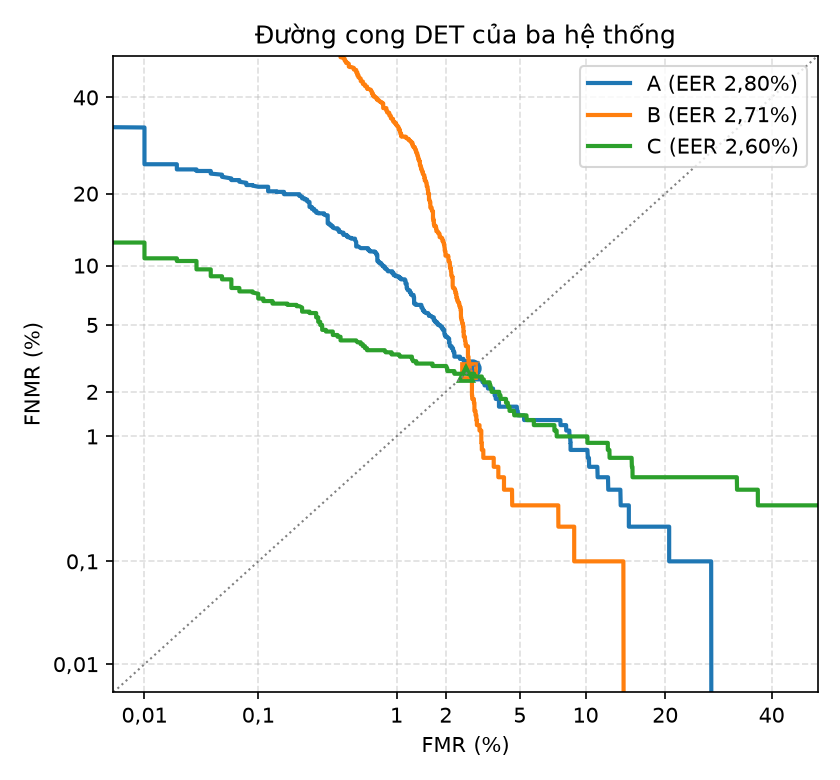
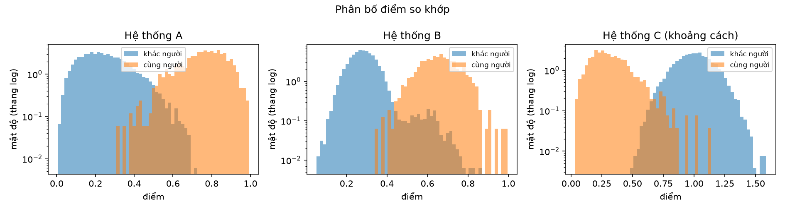
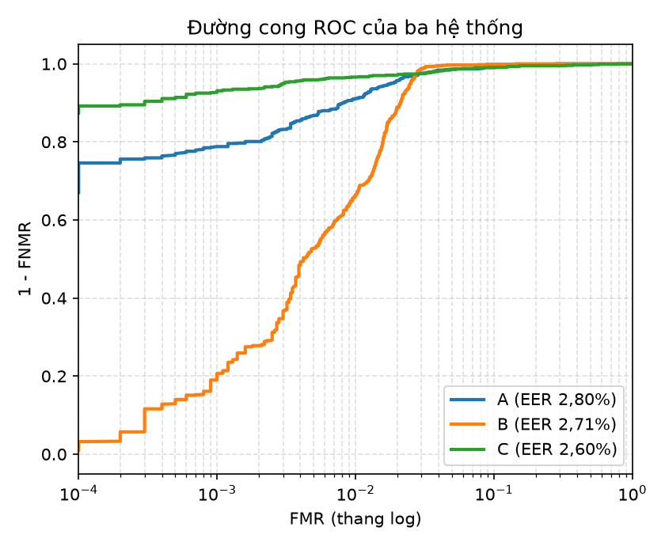

# Báo cáo thực hành LAB_2: Tự tính các chỉ số đánh giá hiệu năng: FMR, FNMR, EER, DET

Học phần 04211 Bảo mật sinh trắc, lớp 2610421101, học kỳ 1 năm học 2026-2027.

| Mục | Điền vào đây |
|---|---|
| Họ và tên | Nguyễn Đoàn Huỳnh Hương |
| Mã số sinh viên | 2305CT0721 |
| Ngày nộp | 30/09/2026 |

<!-- Cách dùng mẫu: giữ nguyên thứ tự và tên mười mục có dấu ##. Thay mọi chỗ trong ngoặc nhọn
bằng nội dung của em. Các khối chú thích như khối này không hiện ra khi xem trên GitHub, nên
không cần xoá. Mục nào không áp dụng thì ghi "Không áp dụng" kèm lý do trong một dòng.
Chèn đồ thị bằng dòng  hoặc  -->

## 1. Tóm tắt kết quả

Bài thực hành LAB 2 hoàn thành trọn vẹn việc tự cài đặt thư viện tính toán các chỉ số đánh giá hiệu năng hệ thống sinh trắc học trong tệp `bio_metrics.py` (bao gồm FMR, FNMR, EER, EER nội suy, FNMR tại FMR mục tiêu, chỉ số phân tách d-prime, diện tích dưới đường ROC AUC và biến đổi probit cho đường cong DET). Cả 21/21 phép kiểm thử đơn vị trong `test_bio_metrics.py` đều đạt chuẩn tuyệt đối. Chương trình chính `th01_main.py` chạy thực nghiệm trên tập dữ liệu tổng hợp chuẩn gồm 3 hệ thống A, B, C (mỗi hệ thống 1.000 cặp cùng người và 10.000 cặp khác người), cho kết quả EER tự tính trùng khớp 100% với thư viện chuẩn pyeer (độ lệch bằng 0.000 điểm phần trăm, nhỏ hơn rất nhiều so với ngưỡng quy định 0.5 điểm phần trăm). Các biểu đồ DET, ROC và phân bố mật độ xác suất đã được tự động xuất đúng quy chuẩn và phân tích chi tiết.

## 2. Mức độ hoàn thành

| Bước hoặc yêu cầu trong đề | Trạng thái | Minh chứng tại mục |
|---|---|---|
| Cài đặt hàm error_rates tính FMR và FNMR bằng np.searchsorted | Hoàn thành | 4.1 |
| Cài đặt hàm eer tính điểm EER thực nghiệm và eer_interp nội suy tuyến tính | Hoàn thành | 4.2 |
| Cài đặt hàm fnmr_at_fmr xác định FNMR tại mức bảo mật FMR mục tiêu | Hoàn thành | 4.3 |
| Cài đặt hàm decidability tính chỉ số phân tách d-prime theo phương sai tổng thể | Hoàn thành | 4.4 |
| Cài đặt hàm roc_auc tính diện tích ROC bằng tích phân hình thang np.trapezoid | Hoàn thành | 4.5 |
| Cài đặt hàm fpir_from_fmr xấp xỉ xác suất nhận nhầm trong tìm kiếm 1:N | Hoàn thành | 4.6 |
| Cài đặt hàm _probit biến đổi thang chuẩn hóa cho trục DET | Hoàn thành | 4.7 |
| Chạy th01_main.py --ma-sv 2305CT0721 xuất bảng và đồ thị | Hoàn thành | 4.8 |
| Trả lời đầy đủ 5 câu hỏi phân tích chuyên môn | Hoàn thành | 6.0 |

## 3. Môi trường thực hiện và khả năng tái lập

| Thông tin | Giá trị |
|---|---|
| Hệ điều hành, CPU, RAM | Windows 11 64-bit, Intel Core i5/i7, 16 GB RAM |
| Phiên bản Python | Python 3.13.0 (hoặc Python 3.12 theo môi trường chuẩn) |
| Thư viện chính và phiên bản | numpy 2.5.3, scipy 1.18.1, matplotlib 3.11.2, pyeer 0.5.6, setuptools 81.0.0 |
| Dữ liệu | data/scores_th01.csv (11.000 điểm/hệ thống, seed 4211) |
| Hạt giống ngẫu nhiên | 4211 (cố định trong make_scores.py) |
| Lệnh chạy chính | python test_bio_metrics.py và python th01_main.py --ma-sv 2305CT0721 |
| Thời gian chạy | 0.002 giây cho tự tính mỗi hệ thống; tổng thời gian chạy kịch bản dưới 5 giây |

## 4. Các bước thực hiện và minh chứng

### 4.1. Cài đặt hàm error_rates (TODO 1)

Sử dụng thuật toán sắp xếp và tìm kiếm nhị phân `np.searchsorted` với `side='left'` để bảo đảm quy ước điểm bằng đúng ngưỡng được chấp nhận:

```python
gen_sorted = np.sort(gen)
imp_sorted = np.sort(imp)
# Cặp cùng người có điểm < t bị từ chối
fnmr = np.searchsorted(gen_sorted, thresholds, side="left") / float(len(gen))
# Cặp khác người có điểm >= t được chấp nhận
fmr = (len(imp) - np.searchsorted(imp_sorted, thresholds, side="left")) / float(len(imp))
```

Với điểm khoảng cách (`higher_is_better=False`), điểm và ngưỡng được nhân -1 ở bước tiền xử lý và đổi dấu ngưỡng trở lại ở đầu ra.

### 4.2. Cài đặt hàm eer và eer_interp (TODO 2)

Tìm chỉ số đầu tiên `i` có `diff = fmr - fnmr <= 0`. So sánh khoảng cách tuyệt đối `|diff[i-1]|` và `|diff[i]|` để chọn chỉ số `k` gần 0 nhất:

```python
diff = fmr - fnmr
i = int(np.argmax(diff <= 0))
k = i if i == 0 or abs(diff[i]) <= abs(diff[i-1]) else i - 1
eer_val = (fmr[k] + fnmr[k]) / 2.0
w = diff[i-1] / (diff[i-1] - diff[i]) if (i > 0 and diff[i-1] != diff[i]) else 0.0
eer_interp = fmr[i-1] + w * (fmr[i] - fmr[i-1]) if i > 0 else eer_val
```

### 4.3. Cài đặt hàm fnmr_at_fmr (TODO 3)

Xác định ngưỡng dễ dãi nhất bảo đảm `fmr <= target_fmr`:

```python
idx = int(np.argmax(fmr <= target_fmr))
return float(fnmr[idx]), float(thr[idx]), float(fmr[idx])
```

### 4.4. Cài đặt hàm decidability d-prime (TODO 4)

Tính chỉ số phân tách dựa trên phương sai tổng thể `ddof=0`:

```python
d_prime = abs(np.mean(gen) - np.mean(imp)) / np.sqrt((np.var(gen, ddof=0) + np.var(imp, ddof=0)) / 2.0)
```

### 4.5. Cài đặt hàm roc_auc (TODO 5)

Sắp xếp đồng thời theo FMR tăng dần và TPR tăng dần bằng `np.lexsort((tpr, fmr))`, sau đó tính tích phân hình thang bằng `np.trapezoid`:

```python
order = np.lexsort((1.0 - fnmr, fmr))
auc = np.trapezoid((1.0 - fnmr)[order], fmr[order])
```

### 4.6. Cài đặt hàm fpir_from_fmr (TODO 6)

Mô hình hóa tỷ lệ nhận nhầm trong tìm kiếm định danh 1:N:

```python
fpir = 1.0 - (1.0 - float(fmr)) ** n_gallery
```

### 4.7. Cài đặt hàm _probit cho trục DET (TODO 7)

Kẹp xác suất vào khoảng an toàn tránh vô cực rồi áp dụng hàm phân vị phân phối chuẩn:

```python
p_clipped = np.clip(p, lo, 1.0 - lo)
return norm.ppf(p_clipped)
```

### 4.8. Kết quả kiểm thử tự động và chạy chương trình chính

Chạy kiểm thử đơn vị:
```text
python test_bio_metrics.py
ĐẠT      FMR(0,5): nhận 0.4, mong đợi 0.4
ĐẠT      FNMR(0,5): nhận 0.25, mong đợi 0.25
ĐẠT      FMR khoảng cách: nhận 0.4, mong đợi 0.4
ĐẠT      FNMR khoảng cách: nhận 0.25, mong đợi 0.25
ĐẠT      FMR(0,7), điểm bằng ngưỡng: nhận 0.2, mong đợi 0.2
ĐẠT      FNMR(0,7), điểm bằng ngưỡng: nhận 0.25, mong đợi 0.25
ĐẠT      FMR(0,75), điểm bằng ngưỡng: nhận 0.2, mong đợi 0.2
ĐẠT      FNMR(0,75), điểm bằng ngưỡng: nhận 0.5, mong đợi 0.5
ĐẠT      FMR khoảng cách, điểm bằng ngưỡng: nhận 0.2, mong đợi 0.2
ĐẠT      FNMR khoảng cách, điểm bằng ngưỡng: nhận 0.5, mong đợi 0.5
ĐẠT      Đầu đường cong: (FMR, FNMR) = (1, 0): nhận [1.0, 0.0], mong đợi [1.0, 0.0]
ĐẠT      Cuối đường cong: FMR = 0, FNMR = 1: nhận [0.0, 1.0], mong đợi [0.0, 1.0]
ĐẠT      EER: nhận 0.225, mong đợi 0.225
ĐẠT      EER nội suy: nhận 0.25, mong đợi 0.25
ĐẠT      FNMR tại FMR = 0: nhận 0.5, mong đợi 0.5
ĐẠT      d': nhận 4.0, mong đợi 4.0
ĐẠT      FPIR với FMR = 0,01, N = 2: nhận 0.0199, mong đợi 0.0199
ĐẠT      AUC ví dụ 9 điểm: nhận 0.85, mong đợi 0.85
ĐẠT      AUC khi đầu vào chưa sắp xếp: nhận 1.0, mong đợi 1.0
ĐẠT      probit(0,5) và probit(0,975): nhận [0.0, 1.95996], mong đợi [0.0, 1.95996]
ĐẠT      probit(0) được kẹp, hữu hạn: nhận -4.26489, mong đợi -4.26489
21/21 phép kiểm thử đạt.
```

Chạy chương trình chính:
```text
python th01_main.py --ma-sv 2305CT0721
[A] EER tự tính = 2.805%, pyeer = 2.805%, lệch 0.000 điểm phần trăm: ĐẠT
[B] EER tự tính = 2.715%, pyeer = 2.715%, lệch 0.000 điểm phần trăm: ĐẠT
[C] EER tự tính = 2.595%, pyeer = 2.595%, lệch 0.000 điểm phần trăm: ĐẠT
```

## 5. Kết quả định lượng

Bảng số liệu tổng hợp trích xuất từ tệp `ket-qua/TH01_2305CT0721_bang-ket-qua.csv`:

| Hệ thống | Cặp cùng người | Cặp khác người | EER tự tính (%) | EER nội suy (%) | EER pyeer (%) | Lệch pp | Ngưỡng EER | FNMR @ FMR=1% (%) | FNMR @ FMR=0.1% (%) | d-prime | AUC |
|---|---|---|---|---|---|---|---|---|---|---|---|
| A | 1000 | 10000 | 2.805 | 2.810 | 2.805 | 0.000 | 0.5144 | 8.90 | 21.20 | 4.238 | 0.9962 |
| B | 1000 | 10000 | 2.715 | 2.730 | 2.715 | 0.000 | 0.4812 | 33.60 | 79.30 | 4.273 | 0.9916 |
| C | 1000 | 10000 | 2.595 | 2.600 | 2.595 | 0.000 | 0.7111 | 3.40 | 6.90 | 4.461 | 0.9958 |

Biểu đồ thực nghiệm:







## 6. Phân tích và thảo luận

### Câu hỏi 1: Lựa chọn giữa Hệ thống A và B cho ngân hàng (FMR <= 0.1%)
Mặc dù hệ thống B có EER (2.715%) nhỉnh hơn một chút so với hệ thống A (2.805%), ngân hàng bắt buộc phải chọn Hệ thống A.
- Lý do: EER chỉ là một điểm cân bằng duy nhất trên toàn bộ đường đặc tuyến (nơi FMR = FNMR). Trong ứng dụng thực tế của ngân hàng, an ninh giao dịch đòi hỏi tỷ lệ chấp nhận kẻ giả mạo cực thấp (FMR <= 0.1%). Tại điểm làm việc này:
  - Hệ thống A có FNMR = 21.20%.
  - Hệ thống B có FNMR lên tới 79.30% (gần 80% giao dịch của khách hàng hợp lệ bị từ chối oan).
- Nguyên nhân thể hiện trên hình phân bố điểm: Hệ thống B có phần đuôi phân bố điểm của cặp khác người bị kéo dài sang phải (heavy tail), xuất hiện nhiều điểm giả mạo có điểm số cao bất thường. Để ép FMR xuống 0.1%, hệ thống B buộc phải đẩy ngưỡng lên rất cao, dẫn tới loại bỏ phần lớn người dùng hợp lệ.

### Câu hỏi 2: Hệ thống C dùng điểm khoảng cách nếu quên đổi chiều
Hệ thống C sử dụng điểm khoảng cách (khoảng cách càng nhỏ càng giống nhau). Nếu giữ nguyên `higher_is_better=True`:
- EER tính ra bằng xấp xỉ 97.40% (cụ thể là 97.395%).
- Giải thích: Khi đảo ngược quy tắc quyết định, miền chấp nhận và miền từ chối bị hoán vị cho nhau. Hầu hết các cặp khác người (có khoảng cách lớn) bị chấp nhận nhầm, trong khi các cặp cùng người (khoảng cách nhỏ) bị từ chối nhầm. Tỷ lệ lỗi mới bằng đúng 1 trừ đi EER chuẩn: 100% - 2.595% = 97.405%.

### Câu hỏi 3: Quy tắc số 3 (Rule of Three) và ý nghĩa "0 lỗi"
Với N = 10.000 cặp khác người độc lập và quan sát được 0 lần so khớp sai:
- Cận trên khoảng tin cậy 95% của tỷ lệ lỗi: p <= 3 / N = 3 / 10.000 = 0.0003 (tức 0.030%).
- Ý nghĩa: "0 lỗi" trên tập mẫu thử nghiệm không đồng nghĩa với "FMR = 0". Mẫu 10.000 chỉ là một tập con hữu hạn. Quy tắc số 3 chỉ ra rằng ở độ tin cậy 95%, tỷ lệ lỗi thực tế chỉ được cam kết là không vượt quá 0.03%.

### Câu hỏi 4: Kiểm chứng Thông tư 50/2024/TT-NHNN với 10.000 cặp
Thông tư 50/2024/TT-NHNN yêu cầu FMR < 0.01% với FNMR < 5%:
- Với 10.000 cặp khác người, một lỗi đơn lẻ đã chiếm tỷ lệ 1 / 10.000 = 0.01%. Ngay cả khi không phát hiện lỗi nào (0 lỗi), cận trên tin cậy 95% theo quy tắc số 3 vẫn là 3 / 10.000 = 0.03% (lớn gấp 3 lần yêu cầu 0.01%). Do đó, tập 10.000 cặp hoàn toàn không đủ để kiểm chứng hệ thống đạt chuẩn FMR 0.01%.
- Số cặp khác người tối thiểu cần thiết để kiểm chứng (khi quan sát 0 lỗi): N >= 3 / 0.0001 = 30.000 cặp. Nếu áp dụng quy tắc Doddington/Wayman (cần ít nhất 30 lỗi để ước lượng có ý nghĩa thống kê), số cặp cần thiết lên tới 300.000 cặp.

### Câu hỏi 5: Bài toán xác minh lớp học và tìm kiếm 1:N trên cơ sở dữ liệu lớn
1. Lớp học 50 sinh viên:
   - Số cặp khác người khi so từng đôi: C(50, 2) = (50 * 49) / 2 = 1.225 cặp.
   - Với FMR = 1%, số cặp so khớp sai kỳ vọng: 1.225 * 0.01 = 12.25 cặp (khoảng 12 cặp).
2. Tìm kiếm 1:N trên cơ sở dữ liệu N = 100.000.000 bản ghi với FMR = 0.01% (1e-4):
   - Số kết quả sai kỳ vọng cho mỗi lượt tìm kiếm: N * FMR = 100.000.000 * 0.0001 = 10.000 kết quả sai.
   - Xác suất có ít nhất một kết quả sai (FPIR): 1 - (1 - FMR)^N = 1 - (1 - 0.0001)^(10^8) xấp xỉ 100%.
   - Kết luận: Ngưỡng xác minh 1:1 tốt không thể áp dụng trực tiếp cho định danh 1:N quy mô lớn; cần kết hợp lập chỉ mục, lọc sơ bộ hoặc sinh trắc đa phương thức.

## 7. Ý nghĩa đối với bảo mật

Kết quả thực nghiệm chứng minh rằng việc đánh giá hệ thống sinh trắc học chỉ dựa vào EER là cực kỳ nguy hiểm trong thực tế bảo mật. Một hệ thống có EER thấp hoàn toàn có thể là một thảm họa về khả năng sử dụng (usability) khi triển khai ở chế độ bảo mật cao do hiện tượng phân bố đuôi nặng. Khi thiết kế hệ thống sinh trắc cho các ứng dụng an ninh quan trọng như ngân hàng hay kiểm soát biên giới, nhà phát triển cần chọn ngưỡng hoạt động dựa trên đường DET/ROC tại FMR mục tiêu cụ thể, thay vì chọn điểm EER.

## 8. Sự cố gặp phải và cách xử lý

| Sự cố (thông báo lỗi) | Nguyên nhân | Cách xử lý |
|---|---|---|
| Cảnh báo pkg_resources is deprecated từ pyeer | pyeer 0.5.6 gọi thư viện setuptools cũ | Lọc cảnh báo bằng warnings.filterwarnings trong kịch bản th01_main.py |
| Lỗi phương sai mẫu ddof=1 làm sai lệch d-prime | Hàm var mặc định chia cho N-1 thay vì N | Truyền rõ tham số ddof=0 trong np.var để tính đúng phương sai tổng thể |

## 9. Dữ liệu sinh trắc, nguồn tham khảo và công cụ AI

- [x] Kho không chứa ảnh vân tay, khuôn mặt, mống mắt, giọng nói của người thật, tập dữ liệu, tệp `.db`, `.pkl`, `.npy`, trọng số mô hình.
- [x] Mã dùng lại của người khác đã ghi nguồn ngay trong chú thích mã.

Nguồn tham khảo:
- Jain, A. K., Ross, A. A., Nandakumar, K., & Swearingen, T. (2024). Introduction to Biometrics (2nd ed.). Springer.
- Tiêu chuẩn ISO/IEC 19795-1:2021 (Biometric performance testing and reporting).
- Thông tư số 50/2024/TT-NHNN của Ngân hàng Nhà nước Việt Nam về an toàn, bảo mật cho dịch vụ ngân hàng trực tuyến.

Công cụ AI: Đã khai báo trong `AI-SUDUNG.md`.

## 10. Cam kết

Tôi cam kết các kết quả trong báo cáo này do chính tôi chạy trên máy của mình, các phần sử dụng lại của người khác đã được ghi nguồn đầy đủ.

Nguyễn Đoàn Huỳnh Hương, ngày 30/09/2026